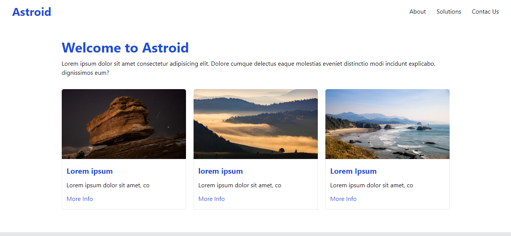

# Welcome to [Astro](https://astro.build)





astroAstroid is a minimal, responsive, accessible and SEO-friendly Astro blog theme. This theme is designed and crafted based as a proyect.

This theme no follows best practices and provides accessibility out of the box. It has not got Light and dark mode by default.

This theme is self-documented \_ which means articles/posts in this theme can also be considered as documentations.

## 🔥 Features

- [x] super fast performance
- [x] accessible (Keyboard/VoiceOver)
- [x] responsive (mobile ~ desktops)
- [x] SEO-friendly
- [x] draft posts & pagination
- [x] highly customizable


## 🚀 Project Structure

Inside of AstroPaper, you'll see the following folders and files:

```bash
/
├── public/
│   │   └── favicon.svg
├── src/
│   ├── components/
│   └── layouts/
│   │   └── indexLayout.astro
│   │   └── postsLayout.astro
│   └── pages/
│   └──-└── index.astro
│── astro.config.mjs
│── package-lock.json
│── package.json
│── seccionsPost.json
│── tailwind.config.cjs
│── tsconfig.json
└── package.json
```

Astro looks for `.astro` or `.md` files in the `src/pages/posts` directory. Each page is exposed as a route based on its file name.

Any static assets, like images, can be placed in the `public/` directory.

All blog posts are stored in `src/page/blog/posts` directory.

## 📖 Documentation


## 💻 Tech Stack

**Main Framework** - [Astro](https://astro.build/)   
**Styling** - [TailwindCSS](https://tailwindcss.com/)  
**UI/UX** - [Imagination](#)  
**Icons** - [HeroIcons](https://heroicons.com/) | [Tablers](https://tabler-icons.io/)  
**Code Formatting** - [Prettier](https://prettier.io/)    
**Images in About Page** - [https://www.pexels.com/es-es/buscar/4k/])

## 👨🏻‍💻 Running Locally

The easiest way to run this project locally is to run the following command in your desired directory.

```bash
# npm 6.x
npm create astro@latest 
# npm 7+, extra double-dash is needed:
npm create astro@latest
# yarn
yarn create astro
```


## 🧞 Commands

All commands are run from the root of the project, from a terminal:

| Command                | Action                                             |
| :--------------------- | :------------------------------------------------- |
| `npm install`          | Installs dependencies                              |
| `npm run dev`          | Starts local dev server at `localhost:3000`        |
| `npm run build`        | Build your production site to `./dist/`            |
| `npm run preview`      | Preview your build locally, before deploying       |
| `npm run format:check` | Check code format with Prettier                    |
| `npm run format`       | Format codes with Prettier                         |
| `npm run cz`           | Commit code changes with commitizen                |
| `npm run astro ...`    | Run CLI commands like `astro add`, `astro preview` |
| `npm run astro --help` | Get help using the Astro CLI                       |

## ✨ Feedback & Suggestions

If you have any suggestions/feedback, you can contact me via [my email](mailto:herediiaa.e@gmail.com). Alternatively, feel free to open an issue if you find bugs or want to request new features.

## 📜 License

Licensed under the MIT License, Copyright © 2023

---

